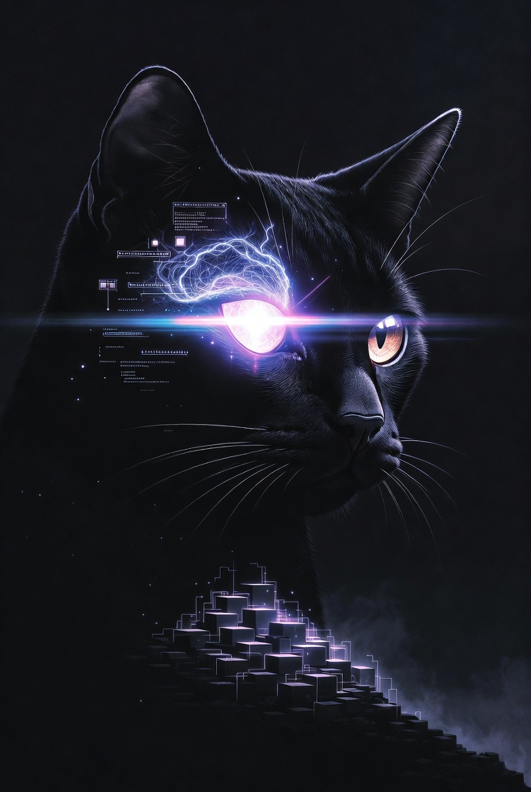
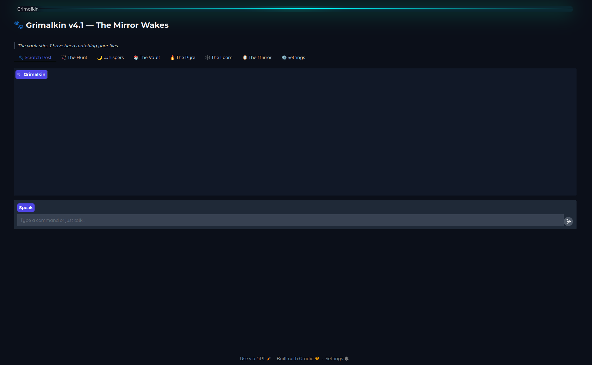

<p align="center">
  
</p>

<h1 align="center">Grimalkin</h1>

<p align="center">
  <strong>A local AI familiar that watches your files, learns your habits, and whispers what you need to know each morning.</strong><br>
  <em>No cloud. No API keys. Just a cat that works the night shift.</em>
</p>

<p align="center">
  
  
  
  
  
  
</p>

---

## What Is This?

Grimalkin is a **single-file, 100% local** AI assistant with a persistent cat familiar persona. It sorts your Downloads folder, indexes documents into a searchable knowledge base, delivers daily briefings, and answers questions about your files — all running on your own hardware with Ollama.

It remembers your habits, tracks a bond level that evolves with use, and judges your file-naming conventions. Harshly.

<p align="center">
  
</p>

## Features

**Morning Whispers** — Daily briefings summarizing new files, patterns, and observations. Opens with "Good morrow, my witch." Closes with "—Grimalkin."

**The Hunt** — Smart file sorting from your Downloads folder. Two-tier classification: instant by extension/keyword, LLM fallback for ambiguous files. Duplicates caught by SHA-256 hash and moved to a DUPLICATES folder (never deleted).

**The Vault** — RAG-powered Q&A over your indexed documents. FAISS vector store with incremental indexing. Supports PDF, Markdown, TXT, CSV, DOCX, RST, RTF, LOG, and JSON.

**Scratch Post** — Feedback system that teaches Grimalkin your preferences. Corrections become stored quirks that influence future behavior. Positive feedback grows the bond; negative feedback makes the cat cautious.

**Bond System** — Relationship meter (0–100) that starts at 30 ("Curious") and evolves through use. Higher bond unlocks more personality, sass, and proactive observations. Negative feedback causes decay. The cat earns your trust.

**Background Watcher** — Daemon thread monitors your Downloads folder every 30 seconds. New files trigger automatic sorting.

**Serious Mode** — Toggle that strips cat behaviors and metaphors but keeps the direct, observant personality. Librarian mode, not generic AI mode.

## Quick Start

### 1. Install Ollama

Download from [ollama.com](https://ollama.com), then pull the models:

```bash
ollama pull qwen3:8b             # reasoning model
ollama pull nomic-embed-text     # embedding model
```

### 2. Clone and Install

```bash
git clone https://github.com/toxic2040/grimalkin.git
cd grimalkin
pip install -r requirements.txt
```

### 3. Run

```bash
python grimalkin.py
```

Open `http://localhost:7860` in your browser. The cat is waiting.

## Requirements

- **Python** 3.10+
- **Ollama** running locally (default: `http://localhost:11434`)
- **~6GB RAM** for qwen3:8b (runs on CPU, faster with GPU)
- Works on Linux, macOS, and Windows (WSL recommended)

## Configuration

All configuration is via environment variables — no config files to manage:

| Variable | Default | Description |
|----------|---------|-------------|
| `GRIMALKIN_BACKEND` | `ollama` | LLM backend (`ollama` or `openai` for compatible APIs) |
| `OLLAMA_BASE_URL` | `http://localhost:11434` | Ollama server address |
| `GRIMALKIN_MODEL` | `qwen3:8b` | Chat model name |
| `GRIMALKIN_EMBED_MODEL` | `nomic-embed-text` | Embedding model name |

Example with a remote Ollama server:

```bash
OLLAMA_BASE_URL=http://192.168.1.50:11434 python grimalkin.py
```

Example with an OpenAI-compatible API (llama.cpp, vLLM, LocalAI):

```bash
GRIMALKIN_BACKEND=openai OLLAMA_BASE_URL=http://localhost:8080/v1 GRIMALKIN_MODEL=local-model python grimalkin.py
```

## Project Structure

```
grimalkin/
├── grimalkin.py          # The entire application (983 LOC)
├── grimalkin_memory.db   # SQLite database (auto-created)
├── requirements.txt      # Python dependencies
├── vault/                # Direct file uploads go here
├── sorted/               # Hunt results organized by category
│   ├── RESEARCH/
│   ├── NOTES/
│   ├── MEETING/
│   ├── PERSONAL/
│   ├── DUPLICATES/
│   └── misc/
└── faiss_index/          # Vector store (auto-created on first index)
```

## How It Works

```
Downloads folder          Grimalkin              Your knowledge base
     │                       │                         │
     ├── new files ──────►  The Hunt ──────►  sorted/ folders
     │                       │                         │
     │                  hash + classify            remember in DB
     │                  (extension → LLM)              │
     │                       │                         │
     │                  Groom the Vault ──────►  FAISS index
     │                       │                         │
     │                  Morning Whispers ◄──── file_memory + quirks
     │                       │                         │
     │                  The Vault Q&A ◄──────  similarity search
     │                       │                         │
     └── Scratch Post ──►  bond + quirks ──────►  personality evolution
```

## The Persona

Grimalkin is not a chatbot wearing a cat skin. The cat behaviors **are** the UX:

| Cat Behavior | System State |
|-------------|-------------|
| Purring | Task completed |
| Hunting | Processing files |
| Hissing | Error or warning |
| Napping | Idle |
| Bringing a gift | Unexpected insight found |
| Coughing hairball | Error with diagnostic |
| Grooming | Re-indexing |

The vocabulary is consistent: your knowledge base is **the Vault**, daily briefings are **Morning Whispers**, file sorting is **the Hunt**, duplicates are **mice**, and your Downloads folder is **the Hunting Ground**.

## Bond Levels

| Level | Name | What Changes |
|-------|------|-------------|
| 0–15 | Wary | Minimal personality. Something went wrong. |
| 16–29 | Cautious | Polite and short. Sizing you up. |
| 30–49 | Curious | Default start. Personality present. Occasional quips. |
| 50–69 | Resident | Full sass. References past interactions. |
| 70–89 | Familiar | Deep memory. Anticipates needs. Protective. |
| 90–100 | Bonded | Rare warmth beneath the snark. |

## Tech Stack

- **LLM:** Ollama (qwen3:8b default, any model works)
- **Embeddings:** nomic-embed-text via Ollama
- **Vector Store:** FAISS (incremental indexing, persistent to disk)
- **Database:** SQLite with WAL mode (interactions, quirks, file memory, bond)
- **UI:** Gradio Blocks with custom dark-mystical CSS theme
- **File Handling:** SHA-256 hashing, two-tier classification, duplicate detection

## Optional Dependencies

The core app runs with just the base requirements. For full Vault indexing:

```bash
pip install langchain-ollama langchain-community langchain-text-splitters faiss-cpu pypdf
```

For `.docx` support:

```bash
pip install docx2txt
```

## Roadmap

- [x] v2.0 — Core loop: Hunt → Index → Whispers → Vault Q&A → Scratch Post
- [x] Bond system with decay and growth
- [x] FAISS incremental indexing
- [x] Corporate-speak scrubber + drift recovery
- [x] Serious mode toggle
- [ ] Custom file categories via Scratch Post
- [ ] Nightly batch topic tagging
- [ ] Per-file LLM-generated notes
- [ ] "Burn" ceremony UI for animated deletion
- [ ] Knowledge graph (entity extraction) — v3.0

## License

MIT — do what you want with it.

## Contributing

Issues and PRs welcome. If the cat hisses at your code, don't take it personally.

---

<p align="center">
  <em>"Every file you save is a whisper. I've been listening since the first one."</em><br>
  <strong>—Grimalkin</strong>
</p>
