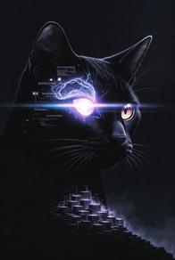

**Your private AI familiar — fully local, fully yours**

[](https://python.org)
[](https://ollama.com)
[](https://github.com/facebookresearch/faiss)
[](https://gradio.app)
[](LICENSE)
[](https://x.com/toxic2040)

---

**~3500 LOC · 100% offline · Ollama + FAISS + Knowledge Graph**

Grimalkin is a local AI familiar that sorts your files, indexes them for instant Q&A, builds a knowledge graph of everything it finds, and develops a personality that sharpens the longer you spend together. No cloud, no API keys, no tracking. One database, one bond, one cat.

## What It Does

**🐾 Scratch Post** — Chat with Grimalkin. Ask questions, run commands, or just talk. It remembers.

**🏹 The Hunt** — Scans your Downloads folder, classifies files by type, copies them into organized folders, and indexes the contents for search. Manual trigger — no background watchers.

**🌙 Whispers** — Daily briefings on your vault: file counts, top categories, graph insights, bond level. Gets more detailed as your bond grows.

**📚 The Vault** — Hybrid search (FAISS semantic + keyword matching) over everything Grimalkin has indexed. Ask by content or by name — both work.

**🔥 The Pyre** — Ritual file deletion with a 3-step confirmation ceremony. Bond-gated (must reach level 30). Burned files cool in ashes for 7 days before true cremation. Reversible until then.

**🕸️ The Loom** — Interactive knowledge graph visualization. Entities and relationships extracted from your files, rendered as a force-directed network. Filter by type, search by name, export to markdown.

**🪞 The Mirror** — Weekly reflections generated from vault activity and graph growth. View past reflections and weave new ones directly from the tab. Grimalkin develops memory across time.

**⚙️ Settings** — Name your familiar, set your title, upload an avatar, toggle sandbox mode, serious mode, graph injection, and custom categories. All runtime — no restarts.

## Stack

| Component | Role |
|-----------|------|
| Python 3.10+ | Runtime |
| [Ollama](https://ollama.com) | Local LLM inference (qwen2.5:14b) |
| FAISS | Vector similarity search |
| LangChain + langchain-ollama | Document loading, text splitting, chat integration |
| Gradio 6.x | Web UI |
| SQLite (WAL) | Persistent storage — files, entities, relationships, settings |
| Plotly | Interactive graph visualization in The Loom |

## Quick Start

### 1. Install Ollama

Download from [ollama.com](https://ollama.com), then pull the models:

```bash
ollama pull qwen2.5:14b          # reasoning model
ollama pull nomic-embed-text     # embedding model
```

### 2. Clone and install

```bash
git clone https://github.com/toxic2040/grimalkin.git
cd grimalkin
pip install -r requirements.txt
```

### 3. Run

```bash
python grimalkin.py
```

Open **http://localhost:7860** in your browser. The cat is waiting.

## Scratch Post Commands

| Command | What it does |
|---------|-------------|
| `hunt` | Scan Downloads, sort and index new files |
| `whispers` | Generate today's briefing |
| `groom` | Run the nightly groom cycle manually (tags, notes, entity extraction) |
| `index` | Re-index any unindexed files in file_memory |
| `ingest` | Discover orphan files in sorted/ not yet tracked |
| `bond` | Check your bond level |
| `stats` | Vault statistics |
| `entities` | List top entities in the knowledge graph |
| `mirror` | Read the latest Mirror reflection |
| `categories` | List all file categories |
| `unburn <hash>` | Restore a file from the Pyre |
| `name <new_name>` | Rename your familiar |
| `address <title>` | Change how Grimalkin addresses you |
| `merge "A" "B"` | Canonicalize two entity names into one |
| `important Name` | Flag an entity as important |
| `forget Name` | Delete an entity and all its relationships |
| `recall Name` | Deep cross-source recall (files + graph + reflections) |
| `help` | Show all commands |

## How It Works

**File sorting:** The Hunt scans `~/Downloads` for new files (by SHA-256 hash), classifies them by extension into categories (FINANCIAL, PERSONAL, RESEARCH, MEDIA, MISC), copies them to `sorted/<CATEGORY>/`, and indexes supported formats into FAISS.

**Hybrid search:** Vault queries run both FAISS semantic search and keyword matching against filenames, tags, and notes. Results are merged and boosted — files matching by name get priority, but semantic matches still surface. Graph connections are injected into context when relevant.

**Knowledge graph:** The nightly groom extracts entities (people, orgs, dates, locations, amounts, topics) and relationships from file contents via LLM. These populate the `entities` and `relationships` tables, visualized in The Loom.

**Bond system:** Every interaction increments your bond level (0–100). Higher bond unlocks features: Pyre access at 30, graph stats in Whispers at 40, proactive insights at 60. Bond level also shapes personality — at Stranger she's aloof and feline; by Bonded she's sharp, opinionated, and fully present.

**Personality:** Tiered persona system with bond-scaled voice, situational mood injection (time of day, vault state, burn history), and anti-corporate scrubbing. She progresses from cat to companion — not by getting bigger, but by waking up.

**The Mirror:** Weekly reflections are generated automatically during the nightly groom cycle, or on demand from The Mirror tab. Each reflection synthesizes vault activity, graph growth, and top entities into a 2–3 sentence entry in Grimalkin's voice, stored permanently in the database.

## Supported File Types

**Full indexing:** PDF, TXT, MD, HTML, CSV, DOCX, DOC, Python, JavaScript, TypeScript, Shell, C/C++, Java, Go, Rust, Ruby, Perl, Lua, Swift, Kotlin, TOML, JSON, YAML, XML, INI, CFG, RTF, LOG

**Sorted but not indexed:** Images (JPG, PNG, GIF), audio/video (MP3, MP4, WAV), archives

## File Structure

```
grimalkin/
├── grimalkin.py              # Main application (~3500 LOC)
├── grimalkin_core.py         # Engine — config, DB, bond, persona, search
├── grimalkin_features.py     # Feature handlers — hunt, groom, pyre, mirror
├── grimalkin_interfaces.py   # Gradio UI builder
├── test_grimalkin.py         # Test suite
├── grimalkin.jpg             # Hero image
├── grimalkin_avatar.jpg      # Avatar / social icon
├── grimalkin.db              # SQLite database (created on first run)
├── requirements.txt
├── LICENSE
├── sorted/                   # Organized files (created on first run)
│   ├── FINANCIAL/
│   ├── PERSONAL/
│   ├── RESEARCH/
│   ├── MEDIA/
│   ├── MISC/
│   ├── PYRE/                 # Burned files awaiting cremation
│   └── DUPLICATES/
├── faiss_index/              # FAISS vector index (created on first run)
└── vault/                    # Reserved for future use
```

## Requirements

- Python 3.10+
- Ollama running locally with `qwen2.5:14b` and `nomic-embed-text`
- ~16 GB RAM recommended (for the 14B model)
- Works on Linux, macOS, Windows (tested on Pop!_OS)

## License

MIT — do whatever you want with it.

---

*I sort your files, guard your vault, and judge you silently.*
*— Grimalkin*
